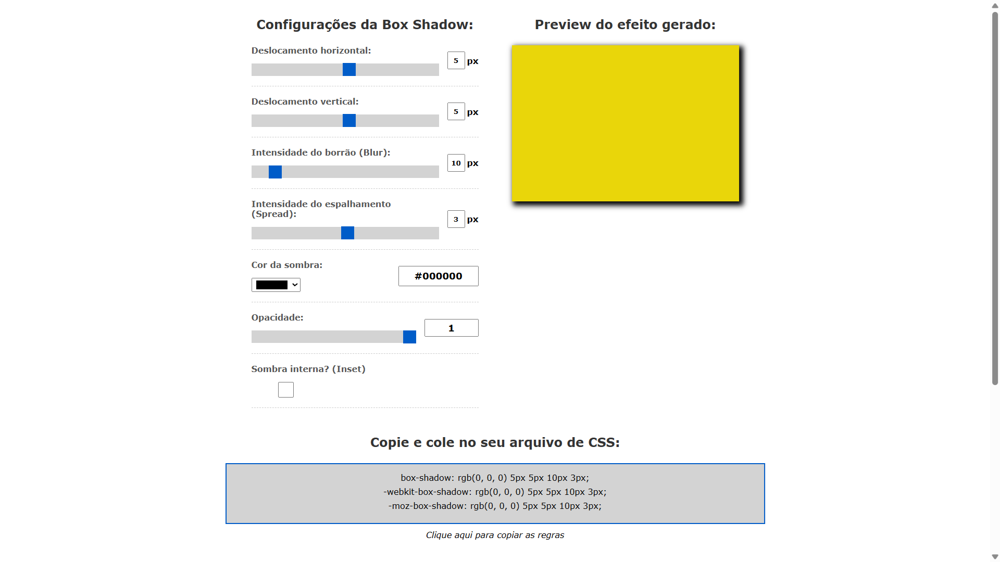

# 🎨 Layered Shade - Box Shadow Generator

A modern and interactive web tool for generating CSS shadows (`box-shadow`) and Dart/Flutter code (`BoxShadow`) visually.

[🇧🇷 Português](docs/pt-BR/README.md)

[](https://layeredshade.netlify.app/)
[](https://github.com/Franklyn-R-Silva/Layered-Shade/actions/workflows/ci.yml)
[](https://github.com/Franklyn-R-Silva/Layered-Shade/actions)
[](https://github.com/Franklyn-R-Silva/Layered-Shade)
[](LICENSE)
[](https://pagespeed.web.dev/analysis/https-layeredshade-netlify-app/1)
[](https://pagespeed.web.dev/analysis/https-layeredshade-netlify-app/1)
[](https://pagespeed.web.dev/analysis/https-layeredshade-netlify-app/1)
[](https://pagespeed.web.dev/analysis/https-layeredshade-netlify-app/1)

## 🛠️ Technologies


## 🚀 Demo

[👉 Try it online](https://layeredshade.netlify.app/)

### Preview



### Demo Animation


## ✨ Features

### Shadows

- **Real-time Preview**: Instant preview of changes
- **Multiple Layers**: Create complex shadows with multiple layers
- **Full Control**: Adjust X, Y, blur, spread, color and opacity
- **Inset Support**: Inner shadows with automatic Flutter package suggestion

### Background & Shape

- **Gradients**: Linear and radial with multiple color stops
- **Custom Shape**: Adjust border-radius and padding
- **Presets**: Ready-made templates (Soft, Neumorphism, Glass)

### Export

- **CSS**: Ready-to-use code with prefixes (-webkit, -moz)
- **Dart/Flutter**: Formatted BoxShadow and BoxDecoration
- **Tailwind**: Arbitrary utility classes
- **Smart Copy**: Context-sensitive button (CSS/Dart/Tailwind)

## 📊 Tech Stack

| Technology     | Usage                                               |
| -------------- | --------------------------------------------------- |
| **Svelte 5**   | Reactive UI with runes (`$state`, `$derived`)       |
| **TypeScript** | Typed state, logic and components                   |
| **Vite**       | Dev server and production build                     |
| **CSS3**       | Variables, Grid, Flexbox, Animations, Glassmorphism |
| **Vitest**     | Unit tests for the pure logic core                  |

## ♿ Accessibility (A11y)

This project was developed with accessibility in mind:

- **Skip Link**: Quick navigation for keyboard users
- **Semantic Landmarks**: `main`, `header`, `footer`, `nav`, `aside`
- **ARIA Roles**: Tabs with `role="tablist"` and `role="tabpanel"`
- **Descriptive Labels**: All buttons and links with `aria-label`
- **Focus Visible**: Enhanced focus indicators
- **Hidden Decoratives**: `aria-hidden="true"` on visual elements

## 📁 Architecture

A **pure, framework-free logic core** with a thin **reactive UI** on top:

```text
src/
├── App.svelte           # Layout composition
├── main.ts              # Mounts the app
└── lib/
    ├── shadow.ts        # Pure state + code generation (CSS/Dart/Tailwind)
    ├── shadow.test.ts   # Unit tests (no DOM)
    ├── state.svelte.ts  # $state singleton + actions
    ├── types.ts
    ├── config/controls.ts
    └── components/       # Control, LayerList, BackgroundPanel, CodeOutput, …
```

For complete technical details, see [ARCHITECTURE.md](ARCHITECTURE.md).

## 🚀 Getting Started

### Online

Visit [layeredshade.netlify.app](https://layeredshade.netlify.app/)

### Locally

```bash
git clone https://github.com/Franklyn-R-Silva/Layered-Shade.git
cd Layered-Shade
npm install
npm run dev      # http://localhost:5173
```

Build for production with `npm run build` (output in `dist/`) and preview it with `npm run preview`.

## 🧪 Testing

```bash
npm install            # Install dependencies
npm test               # Run tests
npm run test:coverage  # Run with coverage
npm run check          # Type-check (svelte-check)
npm run lint           # Check code style
```

Automated tests target the **pure logic core** (`src/lib/shadow.ts`) — state mutations and the
CSS/Dart/Tailwind generators — which have no DOM dependency and are covered at ~99%. The Svelte
components are verified via `svelte-check` and manual testing.

## ⚠️ Known Limitations

- **Flutter `inset`**: Flutter's native `BoxShadow` has no inset. When "inset" is enabled,
  the generated Dart emits a note that the [`flutter_inset_box_shadow`](https://pub.dev/packages/flutter_inset_box_shadow)
  package is required.
- **Multiple background gradients in Flutter**: `BoxDecoration` accepts only one gradient,
  so the Dart export uses the top gradient layer. CSS/Tailwind export all layers.

## 📝 Contributing

1. Fork the project
2. Create your branch (`git checkout -b feature/NewFeature`)
3. Commit your changes (`git commit -m 'Add new feature'`)
4. Push to the branch (`git push origin feature/NewFeature`)
5. Open a Pull Request

See [CONTRIBUTING.md](CONTRIBUTING.md) for detailed guidelines.

## 👤 Author

Franklyn R. Silva

- GitHub: [@Franklyn-R-Silva](https://github.com/Franklyn-R-Silva)
- LinkedIn: [franklyn-roberto-dev](https://www.linkedin.com/in/franklyn-roberto-dev/)

## 📄 License

This project is licensed under the [MIT License](LICENSE).

---

⭐ If this project was helpful, consider giving it a star!
